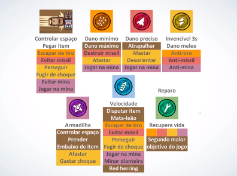

# Game Design para Jogos Pequenos

- [1.1 - Introdução](#11---introdução)
- [1.2 - O que é Game Design](#12---o-que-é-game-design)
- [1.3 - Sua ideia não vale nada](#13---sua-ideia-não-vale-nada)

- [2.1 - Público e Plataforma](#21---público-e-plataforma)
- [2.2 - KISS: Keep It Simple, Stupid](#22---kiss-keep-it-simple-stupid)
- [2.3 - Prototipar e Testar](#23---prototipar-e-testar)

- [3.1 - Criatividade e repertório](#31---criatividade-e-repertório)
- [3.2 - Geração de alternativas](#32---geração-de-alternativas)
- [3.3 - Visão de Design](#33---visão-de-design)
- [3.4 - Um processo: escrever game design](#34---um-processo-escrever-game-design)

- [4.1 - Abstração](#41---abstração)
- [4.2 - Mecânicas, dinâmicas e experiências](#42---mecânicas-dinâmicas-e-experiências)
- [4.3 - Quais são seus verbos?](#43---quais-são-seus-verbos)
- [4.4 - Sistemas de tensão e risco recompensa (parte 1)](#44---sistemas-de-tensão-e-risco-recompensa-parte-1)
- [4.4 - Sistemas de tensão e risco recompensa (parte 2)](#44---sistemas-de-tensão-e-risco-recompensa-parte-2)
- [4.5 - Ortogonalidade](#45---ortogonalidade)
- [4.6 - Counterplay](#46---counterplay)
- [4.7 - Punição](#47---punição)

## 1.1 - Introdução:

- Felipe Dal Molin (Luderia Jogos Digitais);

### Luderia Jogos Digitais:

- Battle Rides Duel: jogo *Mobile* de duelo de carros para 2 jogadores;
- Spook Lands: jogo de tiro de um dedo só;

### Por quê jogos pequenos?

- Precisamos ter cuidado com a expectativa e o tamanho de projetos;
- É muito importante ter o ponto de vista de criar um jogo pequeno bom, com um *Game Design* bem feito, em um projeto que não tenha um escopo enorme. Isso também pode ser implantado em jogos com escopos maiores, quando tiver mais experiência;

### Estrutura do curso:

1. Intro: introdução sobre *Game Design* e ideias;
2. Coisas para se ter em mente antes de começar: escopo, público, prototipagem;
3. O processo de design: criatividade, geração de alternativas, cuitado com detalhes;
4. Drops de game design: ideias mais "pontuais" sobre desenvolvimento de sistemas (abstração, risco-recompensa);
5. Mais alguma coisa: mercado, cenário atual de jogos;

## 1.2 - O que é Game Design:

- A arquitetura do jogo;
- Todas as definições de regra, comportamento, inimigos, habilidades do jogador. Tudo que o jogador faz para "conversar" com o jogo e o que o jogo faz para "responder" para o jogador;
- Simples de começar, difícil de dominar;

### Quem é o Game Designer?

- É quem faz o *Game Design*;

#### Características de um Game Designer:

##### Papéis:

- Artesão de experiência: ele molda a experiência que o jogador terá;
- Comunicador: precisa apresentar suas ideias para a equipe, e fazer o *pitch* da ideia;
- Funileiro: realiza o polimento;

##### Personalidade:

- Contador de histórias: precisa saber conquistar/convencer, explicar suas ideias;
- Criativo: criar a partir de suas experiências;
- Empático: entender a equipe e o jogador. Deixar a experiência o mais agradável possível;

##### Habilidades:

- Repertório de jogos: se inspirar em jogos bons e evitar erros de jogos ruins;
- Matemática e programação: ter uma noção para não pedir coisas impossíveis;
- Experiência: só vem com o tempo. Erros e acertos em projetos;

##### Perigos:

- Superproteção: proteger suas ideias como se fossem seus filhos. É preciso saber quando parar e aceitar seus erros;
- Desculpas: "não consigo". É preciso evitar desculpas para obter experiência;
- Ambição: leva à frustração e perda de tempo;

### Desafio: Liste seus pontos fortes e fracos como Game Designer:

- Pontos fortes: repertório de décadas, programação e experiência em desenvolvimento;
- Pontos fracos: empático, superproteção e ambição, pela teimosia de não desistir de uma ideia;

## 1.3 - Sua ideia não vale nada:

- Ideias são baratas. Qualquer membro de uma equipe terá ideias próprias, mas não há tempo para fazer todas as ideias;
- Não é uma ideia que te deixará rico, o trabalho e esforço farão isso;
- Uma ideia pode ter infinitos resultados diferentes. O resultado do trabalho em cima de uma ideia é o que trará a recompensa;

### Desafio: Liste uma ideia sua que alguém fez antes!

- Não lembrei de nada agora, se eu lembrar edito :)

## 2.1 - Público e Plataforma:

- Cada plataforma e cada público possui uma orientação diferente na hora de pensar no *Design* do seu jogo;
- O criador de Flappy Bird pensou em desenvolver um jogo em que só precisasse de uma mão para jogar. Por isso, escolheu a plataforma *Mobile* para seu jogo, e essa escolha atingiu diversos públicos diferentes, desde crianças até idosos;
- É importante não ter preconceito com outras plataformas, como, por exemplo, *Mobile* ser para jogadores mais casuais. O preconceito impossibilita diversas oportunidades;
- O preconceito também não deve ocorrer com público. *Minecraft* é um jogo mais infantil, com crianças como público-alvo, e é um dos mais vendidos da história;
- Realidade Virtual é uma plataforma que pode trazer um novo público aos vídeo-games, assim como o Wii foi um sucesso com idosos e famílias por ser fácil de aprender;

### 5 pilares do design casual:

- Ficção agradável: visual mais casual, sem *gore* pesado;
- Acessibilidade: não depender de uma experiência prévia, rápido para entrar no jogo;
- Interruptibilidade: deve deixar o jogador jogar por 1 minuto e parar, e voltar do ponto onde parou;
- Leniência: não pune o jogador com muita severidade;
- Reforço positivo: feedback agradável pelas ações do jogador, recompensar o jogador com sons e visuais;

## 2.2 - KISS: Keep It Simple, Stupid:

- "Cuidado com o escopo, irmão";
- Faça jogos simples, com escopo pequeno, mas bem feitos, e não jogos imensos mal-feitos e inacabados;
- "Você vai fazer 10 jogos ruins antes de 1 bom";
- "Simplicidade, o inferno do game designer" - Peter Molyneux;

### Estudos de casos:

#### VVVVVV (Terry Cavanagh):

- Jogo muito bem feito, detalhado, level design genial;
- Grande para um jogo *indie* (4-6h para finalizar);
- Extremamente simples visualmente;
- Desenvolvido por 1 pessoa;
- Sucesso de crítica e comercial;

#### Godus (Peter Molyneux):

- Prometeu muitas coisas (um planeta do tamanho de Júpiter; 50 milhões de jogadores simultâneos; todo mundo no mesmo planeta; controle a vida dos colonos; controle o poder dos deuses; multiplayer com vários deuses; PC, MAC, Linux, iOS, Android; imensamente profundo; casual e hardcore);
- Após anos de desenvolvimento, não possuia nem uma fração do jogo finalizada;
- "A coisa mais assustadora para um designer não são coisas complexas, não é uma aventura com uma história com um final interessante. A coisa assustadora é simplicidade. Isso é o terror. É nosso abismo. É o lugar onde não queremos ir, quando temos que desenhar a coisa mais simples e pura e fazer isso ser extremamente agradável. Isso é um erro que eu sempre cometi, tentar focar em mais de uma coisa ao mesmo tempo.";

### Desafio: Pensei num jogo que tem...

- Imagine o jogo dos seus sonhos e liste 20 características deste jogo:
01. Side-scroller
02. Beat'em up
03. Roguelike
04. Mágica/poderes
05. Armas brancas
06. Destruição de cenário
07. Ragdolls
08. Combate corpo-a-corpo
09. Vários personagens com características e habilidades diferentes
10. Vários níveis
11. Power-ups
12. Chefões
13. Vários tipos de inimigos
14. Transformações/fusões
15. História
16. Movimentação nas paredes (parkour)
17. Utilizar o ambiente/cenário para atacar
18. Sistema de energia/mana
19. Mecânica de defesa/quebra de defesa
20. Mecânica de esquiva/rolar

#### MVP (Minimum Viable Product ou Produto Minimamente Viável):

- Agora selecione as 3 características principais, que formam a identidade do jogo:
1. Beat'em up
2. Mágica/poderes
3. Vários personagens com características e habilidades diferentes

## 2.3 - Prototipar e Testar:

- Nenhuma ideia será implementada exatamente como ela foi concebida. A ideia deve ser testada diversas vezes, e ajustada até ser viável para se tornar um jogo;
- Um protótipo é uma ideia colocada em prática para testar se ela é viável;

### Prototipar:

- Use a arte mais simples possível (recomendado utilizar formas geométricas);
- Se o protótipo não funciona, descarte o quanto antes e siga para o próximo;

### Testar:

- O jogador não é você (sua experiência não é a base para o que é um jogo bom), o jogador não é seu oponente (crie uma experiência boa para o jogador, não para derrotá-lo);
- Playtest é muito importante para entender se suas ideias funcionam com o público;

### Desafio: Prototipe alguma coisa!

- [Guia para iniciantes (Construct 3)](./2.3-prototipar-e-testar/)

## 3.1 - Criatividade e repertório:

- Criatividade é uma habilidade como qualquer outra, você pode praticar, treinar e melhorar;
- Está relacionada diretamente com repertório e referências;
- Todos os jogos, filmes, séries, músicas, livros, artigos, etc. que você já experienciou fazem parte de seu repertório;
- Combinando seu repertório você pode criar experiências únicas;
- Serendipismo: A sorte favorece a mente bem preparada;

## 3.2 - Geração de alternativas:

- Não desenvolva sua primeira ideia. Teste, analise as alternativas;
- Pode parecer perda de tempo, mas a geração de alternativas melhora o produto final;

### Ideias x Decisões:

- Proporção de 10:1;
- As decisões sobre o que é removido são tão importantes quanto as decisões do que estará no jogo;

### Desafio para a vida!

- Gere alternativas!

## 3.3 - Visão de Design:

- Em uma equipe, haverão pontos de vista diferentes sobre o que é o jogo;
- É importante que exista uma noção unificada do que é o jogo. O ideal é ter um documento que define isso. Esse documento deve levar em consideração as ideias da equipe também, para motivá-la e não ficar monótono, que apenas uma pessoa decida à partir de seus gostos;

### Concisão:

- O importante não é o que você coloca, mas o que você deixa de fora;
- É necessário escolher as melhores ideias e filtrar as que não se encaixam;
- Essa concisão deve estar na mão de uma pessoa ou uma equipe, mas não de todo mundo;

## 3.4 - Um processo: escrever game design:

### Com caderno, escrevendo à mão:

- [Exemplos](./3.4-um-processo-escrever-game-design/)
- *Game Design* é um processo mental. É sobre resolver problemas. Você identifica o que quer fazer e precisa achar as formas de fazer aquilo;
- Fazer o *Game Design* à mão, em um caderno, se torna um processo mais detalhado. Por ser mais penoso, mais demorado, isso possibilida visualizar mais alternativas;

### O processo:

01. Tenha uma visão geral de tudo o que precisa ser definido (gameplay, metajogo, mercado);
02. Descreva o que você quer resolver a cada ponto (experiência de jogo, problema a ser resolvido);
03. Defina que experiências você quer que o jogador tenha;
04. Tenha sempre em mente a experiência completa (crie uma mecânica tendo em mente os desafios que o jogador enfrentará);
05. Busque referências (quais jogos já fazem isso? como fazer melhor?);
06. Gere alternativas;
07. Desenhe (rascunhos, nada muito elaborado, mas precisa comunicar a ideia);
08. Tome decisões hipotéticas (e se fosse diferente?);
09. Questione suas decisões (conflitos com outras decisões);
10. Anote os novos problemas;
11. Crie novas alternativas;
12. Questione-as;
13. Enuncie as possibilidades sobreviventes;
14. Mostre, discuta, revise, prototipe, teste, refaça, refine, teste, etc.
- **Obs.:** Até o passo 13 você pode fazer sozinho. O passo 14 é uma etapa colaborativa;

### Desafio: Escreva o game design de uma ideia sua, completinho, à mão:

## 4.1 - Abstração:

- Se é divertido com quadrados, é divertido;

### Mecânica de eliminar todos os inimigos de uma área:

- Zelda: até não eliminar todos os inimigos, a porta para o próximo nível estará fechada;
- Uncharted: até não eliminar todos os inimigos, o NPC que te acompanha não fará a ação necessária para avançar até o próximo nível;
- A abstração é a mesma, porém a dinâmica do jogo é completamente diferente;

### Desafio: Desenhe um Flappy Bird que não seja um Flappy Bird!

## 4.2 - Mecânicas, dinâmicas e experiências:

- *MDA (Mechanics, Dynamics, Aesthetics)*;
- Você usa mecânicas para criar dinâmicas que formam experiências;

### Um jogo tem jogos que têm jogos:

- Uma experiência de jogo pode ser composta de várias dinâmicas, e cada dinâmica vai ter mecânicas diferentes;
- A combinação de mecânicas formam "microjogos" dentro do jogo;

#### Mecânicas:

- São átomos. É o que tem de menor no jogo;
- É muito importante acertar nas mecânicas. Você passará a maior parte do tempo tentando fazer isso funcionar de forma clara para o jogador;
- **Ex.:**
1. Apertar um botão para pular;
2. Comprar um item por 10 moedas;
3. Ganhar XP para subir de nível;

#### Dinâmicas:

- A ação que ocorre;

#### Experiências:

- Desafio, adrenalina, sensação (gráficos, sons), competição;
- Cada experiência terá dinâmicas e mecânicas que a suportam;

### "8 game aesthetics":

- Sensação: luzes, gráficos;
- Fantasia: se tornar um personagem que você não é;
- Narrativa: história e desenvolvimento dos personagens;
- Desafio: querer vencer um nível que exige sua habilidade;
- Socialização: conviver com outros jogadores;
- Descoberta: encontrar o que o jogo têm para te mostrar. Lugares, mecânicas, personagens;
- Expressão: colocar sua própria identidade no jogo;
- Submissão: se entregar para o jogo. Deixar que o jogo defina sua experiência;

#### Outras experiências:

- Imersão tática: instantânea. Decidir um movimento certo como reação para um problema imediata;
- Imersão estratégica: tomar as decisões certas para um evento futuro;
- Imersão narrativa: design de mundo, papel do personagem na história, visual;

### Desafio: Escolha 5 jogos bons. Quais são as 3 principais experiências de jogo de cada um?

- The Last of Us: Narrativa, Submissão e Descoberta;
- Red Dead Redemption 2: Descoberta, Fantasia e Sensação;
- God of War: Fantasia, Desafio e Descoberta;

## 4.3 - Quais são seus verbos?

### O que o jogador faz?

- Escolhas;

### Desafio: Liste verbos de gameplay! Todos que puder lembrar

- **Bônus:** jogo com verbos inusitados;
mover andar correr pular pegar atacar matar reviver escalar conter embrulhar caçar fugir ameaçar sabotar copiar combinar separar quebrar destruir construir montar unir enforcar esgueirar fundir rasgar surpreender habilitar

## 4.4 - Sistemas de tensão e risco recompensa (parte 1):

### Sistemas de tensão:

- São desafios que aumentam a dificuldade do jogo para o jogador, e podem oferecer uma recompensa;

#### Risco recompensa:

- Caminho alternativo onde haverá um desafio maior, porém uma recompensa maior também;
- O jogador cede sua segurança em troca de uma recompensa;
- Isso cria interesse do jogador pelo jogo;
- Ataque x Movimento: todo ataque que o jogador faz move o personagem;
- Poder x Tempo: ataque primário é rápido, mas causa pouco dano, enquanto o ataque secundário é lento mas causa muito dano;
- *Play safe* x *Power-up*: o *Power-up* nasce em um lugar arriscado, isso cria uma situação de risco ao jogador, e força-o a fazer uma escolha;
- Combo x Segurança: o combo deve criar um risco, mas ser recompensador para que valha à pena o jogador fazê-lo. **Ex.:** acumular vários inimigos na tela (risco) e eliminá-los numa rápida sucessão para receber mais pontos (recompensa);

## 4.4 - Sistemas de tensão e risco recompensa (parte 2):

- Ranking online dá uma pressão para você ir melhor;
- Os sistemas de tensão que tu escolhe para seu jogo define o tipo da experiência que o jogo vai ser;
- 10 tentativas? 10 minutos? Tentativas e tempo infinito? 
- O que o jogador precisa pagar para ter uma performance melhor no seu sistema?

### Desafio: Subverta os sistemas de tensão de alguns jogos clássicos:

- Pacman (sem os fantasmas): O caminho percorrido. O jogador inicia com uma quantidade X de pontos, e cada "bloco" percorrido ele perde Y pontos;
- Futebol (com apenas um time): Fazer gols sem a bola tocar o chão. Adicionar obstáculos;
- Space Invaders (se os aliens não se aproximassem): Fazer os inimigos atacar de volta. Criar ameaças do ambiente (chuva de meteoros);
- Caça-níqueis (o que mudaria?): Cada tentativa aumenta uma pequena fração da chance de ganhar o prêmio;

## 4.5 - Ortogonalidade:

### Base simples, implicações complexas:

- Fazem coisas diferentes mas se comunicam entre si;
- *Minimum input, maximum output*: um item, combinado com os outros elementos do jogo, continua funcionando de maneiras distintas;

#### Mecânicas ortogonais:

- Movimento: Controlar espaço, Pegar item, Escapar de tiro (criado à partir do Tiro), Evitar míssil (criado à partir do Míssil), Perseguir (criado à partir do Choque, persegue o oponente para dar dano nele), Fugir de choque (criado à partir do Choque, foge para não receber dano do Choque);
- Tiro: Dano mínimo (ataque quem menos dá dano individualmente), Dano máximo (se acertar todos os tiros, tem o maior dano por segundo), Destruir míssil (criado à partir do Míssil, uma bala destrói o míssil), Afastar (criado à partir do Choque, afasta o oponente para se proteger do Choque);
- Míssil: Dano preciso (sempre a mesma quantidade de dano), Atrapalhar (faz o oponente mudar seu trajeto para desviar), Afastar (criado à partir do Choque, afasta o oponente para se proteger do Choque), Desorientar (criado à partir do Choque, o oponente muda sua trajetória caso o Míssil acerte seu carro);
- Choque: Invencível 3s, Dano melee (encostar no oponente), Anti-tiro (), Anti-míssil ();
- ...

- A ideia da Ortogonalidade é: trabalhar com **menos exceções de design, mais resultados emergentes**;

## 4.6 - Counterplay:

### Para toda ação, uma chance de reação:

- Que dinâmica de gameplay emerge de uma ação? (mecânicas ortogonais)
- Quando um jogador faz uma ação, o que o outro jogador pode fazer para ter vantagem sobre essa ação?
- Quando esse inimigo ataca, o que o jogador **faz**?

### Yomi:

- Tentar prever o que o oponente irá fazer;
- Como em um jogo de xadrez, você deve planejar o seu próximo movimento com base na sua previsão do próximo movimento do oponente;

## 4.7 - Punição:

- O papel da punição mudou muito ao longo da história dos jogos;
- Antigamente, com máquinas de *Arcade*, a punição era fazer o jogador perder para gastar mais fichas;

### Ghouls'n Ghosts:

- Personagem podia sofrer dois ataques, o primeiro tirava a armadura e o segundo o matava;
- O jogo tem um número finito de vidas;
- Após terminar as vidas, o jogo começava do início;
- Extremamente punitivo;

### Super Meat Boy:

- Personagem morre com qualquer deslize, e morre frequentemente;
- O jogo não tem limite de vidas;
- Após morrer, inicia o nível no início;
- Cada nível leva apenas alguns segundos para finalizar;
- Punição moderna: mesmo o jogo sendo difícil, a punição é a mínima possível;

### Prince of Persia (2008):

- Personagem nunca morre, a companheira do personagem principal o salva;
- Isso permite o jogador a errar infinitamente;
- Tentativa de punição que não funcionou;

### Dark Souls:

- Narrativa punitiva;
- Você vai morrer várias vezes, aprender e superar os desafios;
- Não têm limite de vidas, mas pune o jogador fazendo-o "*dropar*" todas suas "almas" (que funcionam como o "dinheiro" do jogo) no local onde morreu;

### Shovel Knight:

- Jogo muito ágil, dificuldade depende da habilidade do jogador;
- Têm checkpoints, mas cada ponto pode ser ativo apenas uma vez;
- Ao morrer, parte do seu dinheiro cai onde você morreu;
- Pune o jogador de forma inteligente, deixando claro ao jogador o que ele perderá caso morrer;

### Desafio: Pense em um sistema de punição diferente de qualquer outro!

- Ao morrer, precisa batalhar com almas de inimigos que também morreram para voltar ao mundo dos vivos. Cada vez que morrer, a dificuldade da batalha aumenta;
